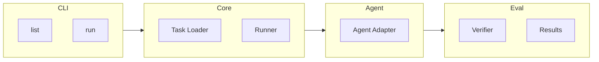

# Agent Bench

An open-source benchmark initiative for evaluating AI coding agents on real-world engineering tasks.

## Overview

Agent Bench creates reproducible evaluation environments derived from authentic development tasks. Unlike synthetic coding benchmarks, it focuses on genuine engineering challenges that reflect real-world software development complexity.

## Goals

1. **Realistic Evaluation** - Test AI agents on actual engineering problems
2. **Reproducible Benchmarking** - Standardized environments for consistent comparison
3. **Continuous Improvement** - Growing task collection to track agent progress

## Quick Start

### Prerequisites

- Python 3.11+
- [uv](https://docs.astral.sh/uv/) (fast Python package installer)
- Git

### Installation

```bash
git clone https://github.com/jiahaoxiang2000/agent-bench.git
cd agent-bench

# Install dependencies
uv sync
```

### Usage

```bash
# List available tasks
uv run agent-bench list

# Run a specific task
uv run agent-bench run --task <task-id> --agent <agent-name>

# Run full benchmark suite
uv run agent-bench run --suite all --agent <agent-name>

# Collect results into CSV
uv run agent-bench collect                    # Creates results/summary.csv
uv run agent-bench collect -o output.csv      # Custom output path
```

## Task Format

```yaml
id: BUG-001
title: "Fix race condition in cache invalidation"
category: bug-fix
difficulty: hard

source:
  repository: https://github.com/org/repo
  commit: abc123def456

prompt: |
  The cache invalidation has a race condition causing
  intermittent test failures. Fix the concurrency issue.

verification:
  type: pytest
  command: "pytest tests/test_cache.py -v"
  timeout: 60

metadata:
  tags: ["python", "concurrency"]
```

## Project Structure (MVP)

```
agent-bench/
├── src/
│   └── agent_bench/
│       ├── __init__.py
│       ├── cli.py              # Command-line interface
│       ├── task.py             # Task model and loader
│       ├── runner.py           # Task execution
│       ├── collect_results.py  # Results aggregation
│       ├── agents/             # Agent adapters
│       │   ├── __init__.py
│       │   └── claude.py
│       └── evaluator.py        # Result verification
├── tasks/                      # Benchmark tasks (YAML format)
│   └── examples/
├── results/                    # Run outputs (JSON + CSV)
├── pyproject.toml              # Project configuration
└── uv.lock                     # Locked dependencies
```

## Architecture (MVP)



## Evaluation Metrics

| Metric       | Description               |
| ------------ | ------------------------- |
| Success Rate | Tasks completed correctly |
| Score        | 0-100 quality score       |
| Iterations   | Attempts before success   |
| Token Usage  | Tokens consumed           |
| Duration     | Time to completion        |

## Results Analysis

After running benchmarks, use the `collect` command to generate a CSV summary:

```bash
# Generate CSV from all JSON results
uv run agent-bench collect

# View results in terminal
column -t -s, results/summary.csv

# Open in spreadsheet software
open results/summary.csv  # macOS
xdg-open results/summary.csv  # Linux
```

The CSV includes: task_id, agent, timestamp, success, score, iterations, duration, tokens, and errors.

## Contributing Tasks

1. **Real-world Origin** - Tasks must come from actual development work
2. **Reproducibility** - Include all context to recreate the scenario
3. **Verifiability** - Provide automated tests that validate the solution

## License

MIT License - see [LICENSE](LICENSE) for details.
